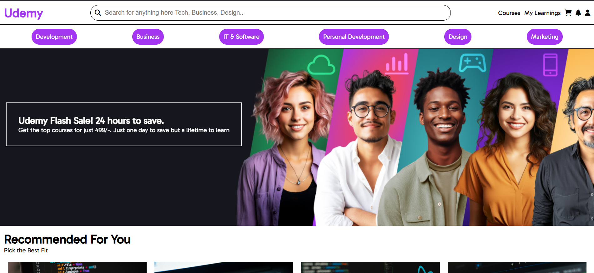
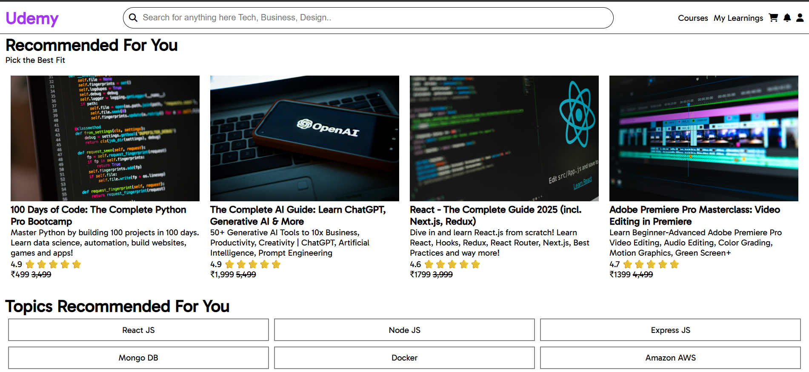

# 🎓 Udemy Clone – Static Website

[](https://developer.mozilla.org/en-US/docs/Web/HTML)  
[](https://developer.mozilla.org/en-US/docs/Web/CSS)  
[](https://opensource.org/licenses/MIT)

A **static clone of the Udemy website** built using **HTML5, CSS3, and Font Awesome**. This project replicates Udemy’s layout, including the navbar, course cards, recommended sections, popular courses, topics, and footer. It demonstrates **responsive design** and modern UI/UX practices.

---

## 📸 Screenshots

### Home Page


### Recommended Section


### Popular Section


---

## 🌐 Live Demo

Check out the live website here: [Udemy Clone Live](https://<your-live-link>.vercel.app)

## 📂 GitHub Repository

View the source code here: [Udemy Clone Repo](https://github.com/<your-username>/udemy-clone)

---

## 🌟 Features

- **Navbar**
  - Logo, search bar, user icons (cart, notifications, profile), and menu.
  - Responsive design with a hamburger menu for smaller screens.

- **Categories Section**
  - Quick access to popular course categories.

- **Sale Section**
  - Promotional banner highlighting flash sales.

- **Recommended Section**
  - Featured courses with title, description, ratings, and price.
  - Multiple courses displayed in a responsive grid.

- **Topics Section**
  - List of recommended topics for users to explore.

- **Popular Section**
  - Displays most popular courses in a card layout.
  - Includes course title, description, rating, and price.

- **Footer**
  - Multi-section footer with About, Discover, Data Science, Legal & Accessibility, IT Certifications, and Udemy for Business.

- **Responsive Design**
  - Mobile-first approach with flexible grids and modern UI styling.

---

## 🛠 Tech Stack

- **Frontend:** HTML5, CSS3  
- **Icons:** Font Awesome  
- **Fonts:** Google Fonts (Gabarito)  

---

## 🚀 Installation & Setup

1. **Clone the repository**
   ```bash
   git clone https://github.com/<your-username>/udemy-clone.git
   cd udemy-clone

---

## 🎮 Usage

- Navigate through the **navbar** to explore categories, courses, and sections.
- Browse **Recommended** and **Popular** courses.
- Check out topics recommended for learning.
- Explore footer links for site information.

---

## 🔮 Future Enhancements

- Make the site **fully responsive** for all devices using media queries.
- Add **interactive elements** using JavaScript (like modals, dropdowns).
- Integrate **real course data** via an API or backend.
- Implement **search functionality** for courses.

